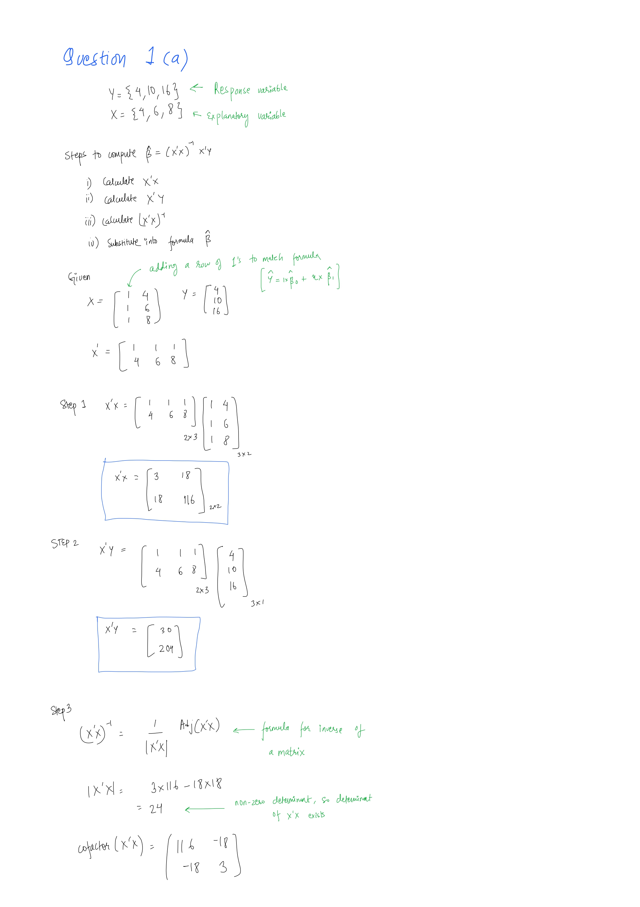
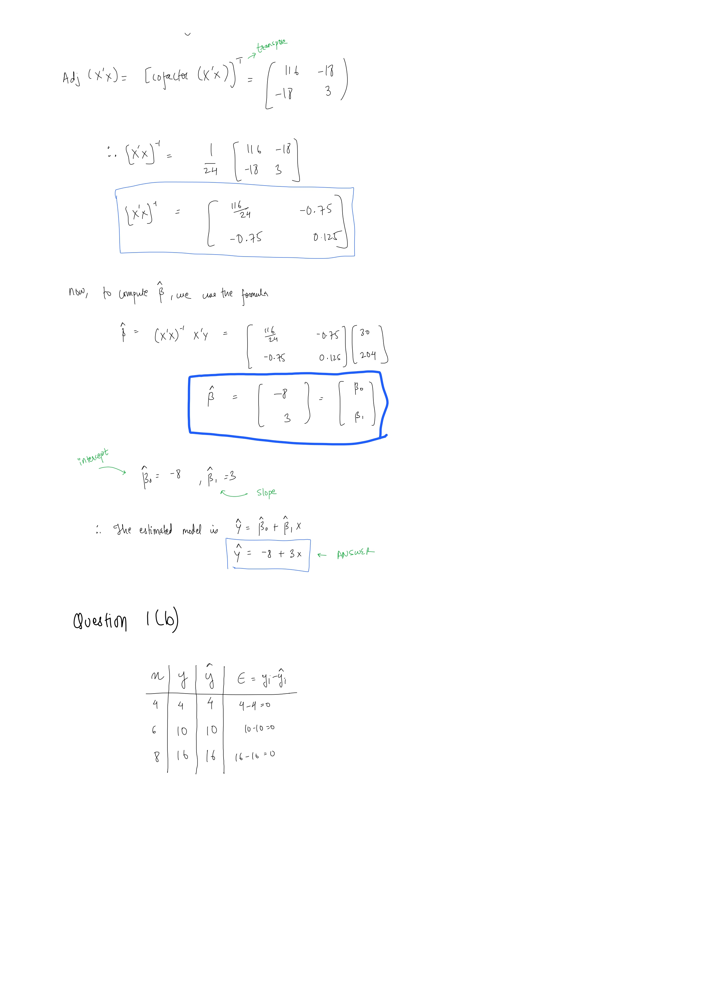

```{r libraries, include=FALSE}
# Import Libraries
library(tidyverse)
library(knitr)
```

# Question 1

## Question 1(a and b)





## Question 1(c)

```{r}
# define matrices

# explanatory variable
x <- matrix(c(1, 1, 1, 4, 6, 8), byrow = FALSE, nrow = 3)

# response variable
y <- matrix(c(4, 10, 16), nrow = 3)

print(x)

print(y)
```

```{r}
# transpose of x

x_t <- t(x)

print(x_t)
```

```{r}
x_t_x <- x_t %*% x

print(x_t_x)
```

```{r}
x_t_y <- x_t %*% y

print(x_t_y)
```

```{r}
# now calculating the inverse of x_t_x

inv_x_t_x <- solve(x_t_x)
print(inv_x_t_x)
```

```{r}
# as we have all the necessary elements, we now substitute the values
# in the formula and calculate the coefficient matrix

b <- inv_x_t_x %*% x_t_y
print(b)
```

Now, Calculating the estimates of residuals

```{r}
y_hat <- x %*% b
e <- y - y_hat

print(e) # output can be considered as zero
```

## Question 1(d)

```{r}
x <- c(4, 6, 8)
y <- c(4, 10, 16)
```

```{r}
df <- data.frame(x, y)

print(df)
```

```{r}
model <- lm(y ~ x, data = df)
summary(model)
```

# Question 2

```{r}
new_x <- c(7, 7, 7)

df2 <- data.frame(new_x, y)

print(df2)

model2 <- lm(y ~ new_x, data = df2)

summary(model2)
```

## Question 2(a)

The slope coefficient $\beta_1$ is `NA` or `undefined`.

The intercept coefficient $\beta_0$ is 10, which is just the average of $Y$

## Question 2(b)

Statistical intuition is that the explanatory variable $X$ is collinear with the intercept. The variance of X is zero, which when put into the formula of $\beta_1$, (ie $\sum (X_i - \bar{X})^2$ = 0), which ends up making the of $\beta_1$ undefined.

## Question 2(c)
Geometrically speaking, there is no horizontal spread accross $X$ axis, due to which the slope($\beta_1$) is undefined. To clarify, slope($\beta_1$) is the variation of $Y$ with respect to variation in $X$. As $X$ is constant for all the points, the regression algorithm is unable to separate the effect of $X$ from the intercept

# Question 3

```{r}
df <- read.csv("dataset/Student_Scores_Dataset.csv", header = TRUE)
head(df)
```

```{r}
model <- lm(Scores ~ Hours, data = df)
summary(model)
```

## Question 3(a)

The regression equation for the student score is as follows:

$$
\hat{y} = 6.530 + 9.763x
$$

## Question 3(b)

The coefficient $\beta_1 = 9.763$ can be interpreted as - A student's score increases by $9.763$ for every additional hour they study.

## Question 3(c)

Yes, the hours of study as a very signification effect on the scores, this is also supported by the very small p-value of $2e-16$, which denotes that changes in scores are heavily influenced by variations in study hours.

## Question 3(d)
 Yes, the model provides a very good fit for the observed data. This is justified by the following figures:

  1. The $Median Residuals = -0.1679$ indicates that the observed values ($Y$) and predicted values ($\hat{Y}$) is small and the model was able to fit very well to the data

  2. The $R^2 = 0.9658$ denotes that the model explains most ($96.6%$) of the variability in the data

  3. Also, The small p-value ($2.2e-16$) also further supports this by indicating that the model is highly significant

## Question 3(e)

**Residual Analysis**

```{r, fig.width = 5, fig.height = 4, fig.align="center"}
residuals <- model$residuals
fitted <- fitted(model)

df_residuals <- data.frame(residuals = residuals, fitted = fitted)

df_residuals |>
  ggplot(aes(x = fitted, y = residuals)) +
  geom_point(size = 0.5) +
  geom_hline(yintercept = 0, color = "red", size = 2) +
  geom_hline(yintercept = 2 * sd(model$residuals), color = "blue", size = 1) +
  geom_hline(yintercept = -2 * sd(model$residuals), color = "blue", size = 1) +
  labs(
    caption = "Figure: Fitted vs Residuals plot for residual analysis"
  ) +
  theme(
    plot.caption = element_text(hjust = 0.5)
  )
```

As show in the plot above, the residual points are scattered evenly around zero (the red line), which suggests that the assumption of the model's linearity is reasonable. Moreover, as the points are evenly scattered throughout all the values of fitted axis (without any funneling patterns), there seems to be no presence of homoscadesticity.

A point to be noted is the funneling line at the right end of the plot. This is due to the scores maxing out at 100, also called "boundary effect". 


## Question 3(f)

```{r, fig.width=5, fig.height=5, fig.align="center"}
df |>
  ggplot(aes(x = Hours, y = Scores)) +
  geom_point(size = 0.5) +
  geom_smooth(method = "lm", formula = y ~ x) +
  labs(
    title = "Regression plot for Scores vs hours studied",
    subtitle = expression(hat(y) == 6.530 + 9.763 * x)
  ) +
  theme_light() +
  theme(
    plot.title = element_text(hjust = 0.5),
    plot.subtitle = element_text(hjust = 0.5)
  )
```

## Question 3(g)

```{r}
new_x <- data.frame(Hours = c(3.63, 5.68, 7.48))

predicted_scores <- round(predict(model, newdata = new_x), 2)

new_x$predicted_scores <- predicted_scores

kable(new_x)
```

It is not valid to make predictions outside of the hours of study range (or generally known as extrapolation) as the linear regression model was estimated using the provided data which might not be in similar trend outside of the range, due to which the model's predictions can end up varying.


# Question 4

```{r}
monkey <- read.csv("./dataset/macaque.csv")

df <- monkey |>
  select(age, mean_fertility)
```

## Question 4(a)

```{r, fig.width=5, fig.height=5, fig.align="center"}
plot_1 <- df |>
  ggplot(aes(x = age, y = mean_fertility)) +
  geom_point() +
  labs(
    title = "Macque average fertility for different age",
    x = "Age",
    y = "Mean age specific fertility",
    caption = "Fig: Fertility trend of female macaques accross age"
  ) +
  theme_light() +
  theme(
    plot.caption = element_text(hjust = 0.5)
  )

plot_1
```

The association is clearly non-linear as illustrated by the rising, peaking and falling curve of the plot. The fertility grows as the macaque ages and peaks at around 9 years of age. Following this is a sharp declining as the macaques age and attaining minimal values at the end of 24 years.

## Question 4(b)

```{r}
model <- lm(mean_fertility ~ age, data = df)

summary(model)
```

The simple linear regression equation is:

$$
\hat{y} = 0.822 - 0.019x
$$

Although it is apparent that a simple linear equation is not the best fit model for this dataset, the above equation can be interpreted as:

$\mathbf{\beta_0 = 0.822}$ : mean fertility at age 0 is 0.822, which is soundly impractical for this scenario

$\mathbf{\beta_1 = -0.019}$ : there is drop of 0.019 mean fertility for every year a female macaque ages

## Question 4(c)

```{r, fig.width = 5, fig.height = 5, fig.align = 'center'}
plot_1 + geom_smooth(method = "lm", formula = y ~ x, se = FALSE)
```

The plot suggests an inadequate fit. There is a curving trend on the points, whereas the linear regression line passes straight under it.

```{r, fig.width = 5, fig.height = 5, fig.align='center'}
draw_residual_plot <- function(df) {
  # nolint start
  ggplot(data = df, aes(x = fitted, y = residuals)) +
    geom_point() +
    geom_hline(yintercept = 0, color = "red", size = 2) +
    geom_hline(yintercept = 2 * sd(model$residuals), color = "blue", size = 1) +
    geom_hline(yintercept = -2 * sd(model$residuals), color = "blue", size = 1) +
    labs(
      caption = "Fig: Residual plot for linear regression model",
      x = "Fitted",
      y = "Residuals"
    ) +
    theme(
      plot.caption = element_text(hjust = 0.5)
    )
  # nolint end
}

df_residuals <- data.frame(
  residuals = model$residuals,
  fitted = fitted(model)
)

draw_residual_plot(df_residuals)
```

The curved pattern in the residual plot above clearly indicates that this model is **not adequate**, ie the linear model fails to fully capture the underlying relationship between the variables. A good fitting model usually is expected to have no patterns and all the points evenly spread out near the center line.

## Question 4(d)

```{r, fig.width = 5, fig.height = 5, fig.align='center'}
plot_1 +
  geom_smooth(method = "lm", formula = y ~ x + I(x^2), se = FALSE)
```

It makes sense to add a quadratic term of degree 2 to the equation to better fit the curve. After changing the equation to quadratic of degree 2, the model was able to fit the datapoints better. 

```{r, fig.width = 5, fig.height = 5, fig.align='center'}
quadratic_model <- lm(mean_fertility ~ age + I(age^2), data = df)

summary(quadratic_model)

quadtratic_df_residuals <- data.frame(
  residuals = quadratic_model$residuals,
  fitted = fitted(quadratic_model)
)

draw_residual_plot(quadtratic_df_residuals)
```

The residual plot of the quadratic linear model also is better. There is no more presence of a pattern, the points are scattered randomly near the center line which suggests that there are no more hidden patterns unaccounted by the model. 

Additionally, there seems to be a uniform distribution of vertical spaces accross the fitted axes, which indicates lack of homoscedasticity.

Lastly, the curvature evident on the previous plot is no longer visible, which proves linearity, ultimately supporting this model to be more adequate as compared to a simple linear model of degree 1.

## Question 4(e)

```{r}
df_new <- data.frame(age = c(6.95, 12.35, 15.87))

predictions <- round(predict(model, newdata = df_new), 2)

df_new$predicted_mean_fertility <- predictions

knitr::kable(df_new, caption = "Table: Predicted Fertility for Given Ages")
```
